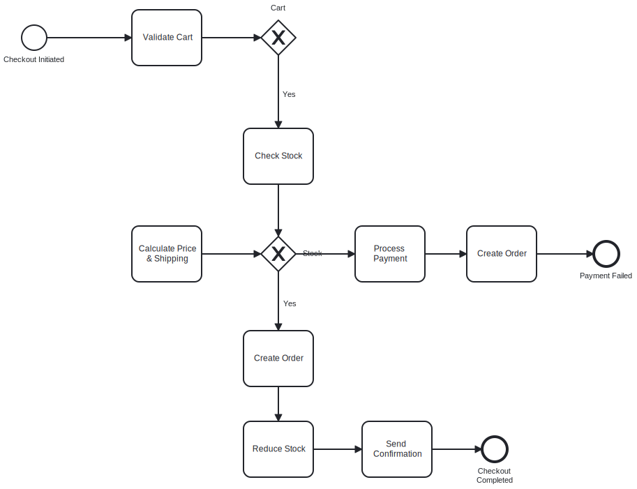

# Soal 1
Bangun layanan yang menerima data dari Kafka topic, melakukan manipulasi data, dan menulisnya kembali ke Kafka atau menyimpannya ke database.

## order-service

## How to Run the Application

### Building and Running with Maven and Docker Compose

1. Build the application using Maven:
   ```shell script
   ./mvnw clean package
   ```

2. Start all services using Docker Compose:
   ```shell script
   docker-compose up
   ```


3. Access the application at:
   - http://localhost:8080

## API Endpoints

The application provides the following REST endpoints:

### Event Data Endpoints

- `GET /api/events/{eventId}/seats` - Gets event details with seat availability for a specific event
- `POST /api/events/cache/refresh` - Refreshes the event cache by loading all events from the database
- `DELETE /api/events/cache/clear` - Clears all event data from the Redis cache
- `GET /api/events/cache/status` - Gets the status of the event cache

### Order Endpoints

- `POST /api/events/order/` - Creates an order for a seat

### Test Endpoints

- `POST /api/test/order/simulate` - Simulates multiple order requests for testing purposes

# Soal 2
Buatkan BPMN untuk proses checkout di marketplace, termasuk penjelasan mengenai service yang digunakan serta ilustrasi BPMN-nya dalam test code tersebut.
## Diagram



| Service                  | Fungsi                                               |
| ------------------------ | ---------------------------------------------------- |
| **Cart Service**         | Menyimpan item yang akan dibeli user                 |
| **Inventory Service**    | Mengecek dan mengurangi stok                         |
| **Pricing Service**      | Menghitung total harga + diskon                      |
| **Shipping Service**     | Menentukan ongkos kirim & estimasi waktu             |
| **Payment Service**      | Integrasi ke payment gateway (Midtrans, Xendit, dsb) |
| **Order Service**        | Membuat dan mengelola data pesanan                   |
| **Notification Service** | Mengirimkan email / push notification ke customer    |
